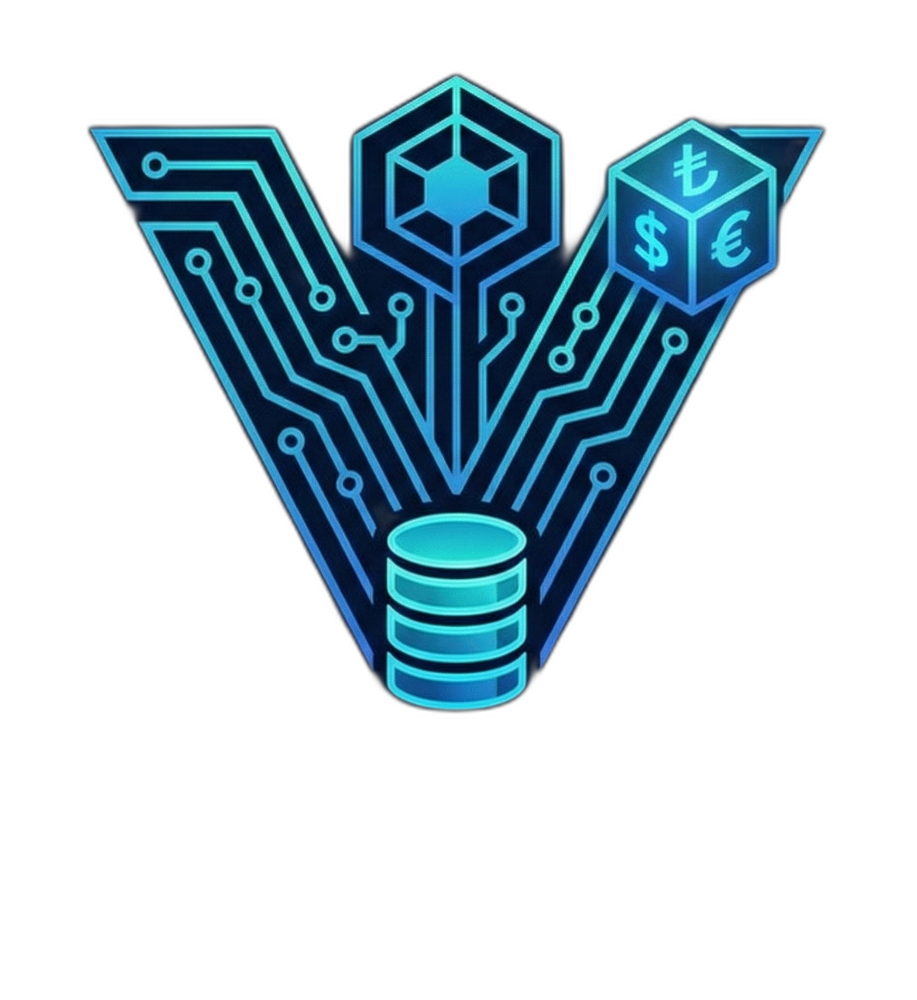

<br/>
<div align="center">
<a href="https://github.com/Cavitbatusoylu/Vireon">

</a>
<h3 align="center">Vireon Projesi</h3>
  <p align="center">
    <strong>Geleceğin Teknolojileriyle Şekillenen Yenilikçi Çözüm Platformu</strong>
    <br/>
    <br/>
    <a href="https://github.com/Cavitbatusoylu/Vireon"><strong>Belgeleri İncele »</strong></a>
    <br/>
    <br/>
    <a href="https://github.com/Cavitbatusoylu/Vireon/issues">Hata Bildir</a>
    ·
    <a href="https://github.com/Cavitbatusoylu/Vireon/issues">Özellik İste</a>
  </p>
</div>

<br/>

## 🌟 Proje Hakkında

**Vireon**, modern yapıları ve ölçeklenebilir altyapısıyla ekiplerin hızlıca yenilikçi projeler üretmesi için tasarlanmış kapsamlı bir tam yığın (full-stack) mimarisidir. Proje; performanslı bir Backend API'ı ile, modern ve etkileşimli kullanıcı deneyimi sunan Frontend yapısını tek bir potada mükemmel bir uyum ile eritir.

Takım çalışmasını ve sürekli gelişimi merkeze alan Vireon, özel sektör ve yarışmalar (örn. TEKNOFEST) hedeflenerek tasarlanmış, baştan sona profesyonel kalitede bir başlangıç sistemidir.

<p align="right">(<a href="#readme-top">yukarı dön</a>)</p>

## 🚀 Teknolojiler ve Altyapı

Vireon'un kalbinde, sektör standartlarında performans sunan güçlü teknolojiler yatıyor:

* **Backend Api:** Güçlü C# / .NET Mimarisi (`VireonAPI`)
* **Frontend UI:** Modern ve Çevik Web Mimarisi (`VireonFrontend`)
* **Veritabanı Entegrasyonu:** Entity Framework Core
* **Esnek Proje Yapısı:** Ekip içi hızlı adaptasyon ve limitsiz erişim prensipleri için tasarlanmış `.slnx` yapısı.

<p align="right">(<a href="#readme-top">yukarı dön</a>)</p>

## 📂 Proje Yapısı ve Mimari

Kod tabanı, sorumlulukları net şekilde ayıran anlaşılır bir düzene sahiptir:

```plaintext
Vireon/
├── VireonAPI/              # Projenin beyni (Backend API, Modeller, Migrationlar)
│   ├── Controllers/        # API Uç noktaları
│   ├── Data/               # Veritabanı Context ve Mimari Bağlantıları
│   └── Models/             # Veri Modelleri (User, Account, Question vb.)
│
├── VireonFrontend/         # Projenin modern yüzü (Kullanıcı Arayüzü)
│   ├── wwwroot/            # CSS, JS, Medya ve HTML dosyaları
│   └── Controllers/        # Frontend İletişim Noktaları
│
└── Vireon.slnx             # Tüm projeyi birbirine bağlayan merkez köprü
```

<p align="right">(<a href="#readme-top">yukarı dön</a>)</p>

## 🛠️ Ekip İçin Başlangıç & Kurulum

Bu depo (repository) özel (private) bir alandır ve tüm ekip üyelerinin takıldıkları yerlerde birbirlerinin dosyalarını özgürce görebilmeleri için kısıtlamalar (`.gitignore` filtreleri) kaldırılmıştır.  

Projeyi yerel bilgisayarınızda (local) ayağa kaldırmak için şu adımları izleyin:

### 1. Projeyi Klonlayın
```bash
git clone https://github.com/Cavitbatusoylu/Vireon.git
```

### 2. Gerekli Bağımlılıkları Yükleyin ve Çalıştırın
Proje kök dizinindeyken arka ucu (API) ve ön yüzü (Frontend) kendi IDE'nizle (Visual Studio / VS Code) çalıştırarak otomatik olarak ilgili servisleri ayağa kaldırabilirsiniz. 

```bash
# Backend için
cd VireonAPI
dotnet run

# Frontend için ayrı bir terminalde
cd VireonFrontend
dotnet run
```
*(Proje `appsettings.json` dosyaları ve gerekli port yapılandırmalarıyla hazır olarak gelmektedir.)*

<p align="right">(<a href="#readme-top">yukarı dön</a>)</p>

## 🤝 Git Çalışma Akışı (Workflow)

Projeyi sağlıklı yürütmek için aşağıdaki adımları takip ediyoruz:

### 👤 1. Geliştiriciler İçin (Örn: Enes)
Kendi bilgisayarınızda yaptığınız değişiklikleri şu şekilde gönderin:

```bash
# 1. Değişiklikleri pakete ekle
git add .

# 2. Yapılan işi özetle
git commit -m "feat: login sayfası tasarımı eklendi"

# 3. Kendi şubene (branch) gönder
git push origin Enes-login
```

---

### 👑 2. Proje Sahibi / Yönetici İçin (Cavit)
Gelen değişiklikleri terminalden kontrol edip ana projeye (main) katmak için:

```bash
# 1. GitHub'daki yeni değişiklikleri tanı
git fetch origin

# 2. Enes'in kodlarını main ile birleştir (Merge)
git merge origin/Enes-login

# 3. Güncellenmiş main dalını GitHub'a geri gönder
git push origin main
```

> [!TIP]
> Eğer merge sırasında "Conflict" (çakışma) uyarısı alırsanız, çakışan dosyaları Visual Studio üzerinden açıp hangi kodun kalacağını seçerek kaydedin, sonra tekrar `add/commit/push` yapın.

<p align="right">(<a href="#readme-top">yukarı dön</a>)</p>

---
<div align="center">
  <b>Vireon Takımı Tarafından Tutkuyla Geliştirildi ❤️</b>
</div>
