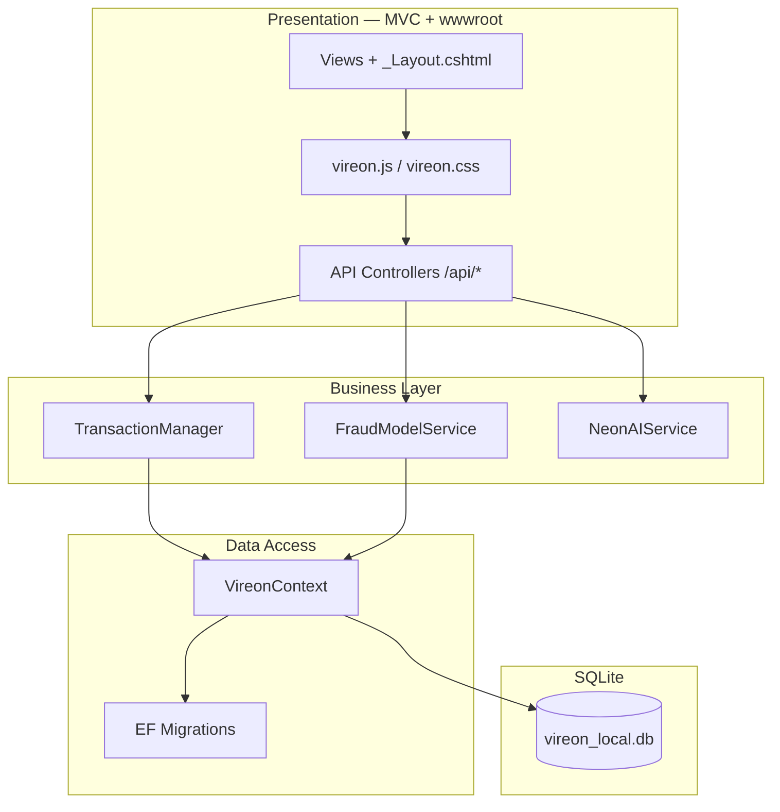
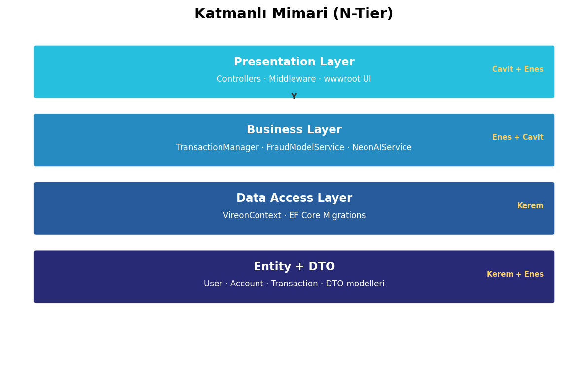
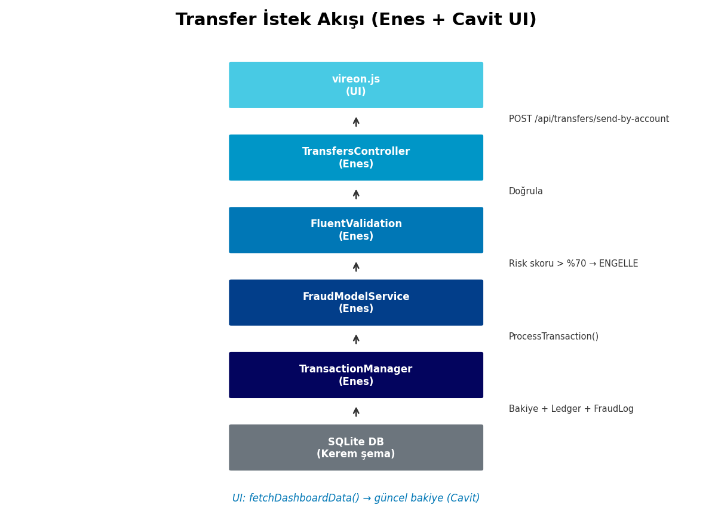

# Vireon — Proje Raporu

**Dijital Banka Çekirdek Sistemi Simülasyonu**  
Bilgisayar Mühendisliği — Final Projesi

---

## 1. Proje Özeti

Vireon; para transferi, hesap yönetimi, günlük limit, fraud loglama ve immutable ledger mantığını **katmanlı ASP.NET Core MVC** yapısı ile modelleyen bir bankacılık çekirdek simülasyonudur.

| Özellik | Açıklama |
|---------|----------|
| Backend | ASP.NET Core 8 Web API + MVC (Razor Views) |
| Veritabanı | SQLite + Entity Framework Core |
| Mimari | Entity → DataAccess → Business → DTO → Presentation |
| Arayüz | Ayrı sayfalar (Home, Account, Dashboard) + `_Layout.cshtml` |

---

## 2. Katman Yapısı

| Katman | Proje | Sorumluluk |
|--------|-------|------------|
| **Entity** | `Vireon.EntityLayer` | `User`, `Account`, `Transaction`, `LedgerEntry`, `DailyLimit`, `FraudLogs` |
| **Data Access** | `Vireon.DataAccessLayer` | `VireonContext`, EF Core migration, `DatabaseSeeder`, `DatabaseSchemaAlignment` |
| **Business** | `Vireon.BusinessLayer` | `TransactionManager`, `UserService`, `FraudModelService`, `NeonAIService` |
| **DTO** | `Vireon.DtoLayer` | API istek/yanıt modelleri (`LoginDto`, `TransferRequestDto`, …) |
| **Presentation** | `Vireon.PresentationLayer` | MVC Controller + View + ViewModel, REST API Controller, static assets |

### ViewModel örnekleri (Presentation)

- `PageViewModel` — sayfa başlığı ve anahtar
- `SectionPageViewModel` — tanıtım alt sayfaları
- `DashboardPageViewModel` — aktif dashboard bölümü
- `LoginViewModel` — giriş sayfası

---

## 3. Sistem Mimarisi





---

## 4. Sayfa Haritası (URL)

| URL | Sayfa | Açıklama |
|-----|-------|----------|
| `/` | Ana menü | Proje bölümlerine giriş kartları |
| `/Home/Introduction` | Tanıtım | Proje hero ve özet |
| `/Home/Components` | Bileşenler | Modül listesi |
| `/Home/Architecture` | Mimari | Katman ve veri akışı |
| `/Home/Team` | Ekip | Rol bazlı ekip kartları |
| `/Home/About` | Hakkında | Proje kapsamı |
| `/Home/Contact` | İletişim | İletişim formu |
| `/Account/Login` | Giriş | `LoginViewModel` |
| `/Account/Register` | Kayıt | Yeni kullanıcı |
| `/Dashboard/Overview` | Hesap özeti | Bakiye, grafikler |
| `/Dashboard/Transfer` | Para gönder | Transfer + kur simülasyonu |
| `/Dashboard/Deposit` | Para yatır | Bakiye artırma |
| `/Dashboard/History` | İşlem geçmişi | Tüm işlemler |
| `/Dashboard/Limits` | Günlük limitler | Limit kullanımı |
| `/Dashboard/Admin` | Admin paneli | Yönetim (Admin rolü) |

---

## 5. Ekran Görüntüleri

> Uygulamayı çalıştırıp (`dotnet run`) aşağıdaki sayfalardan ekran görüntüsü alın. Örnek diyagramlar `tools/docs/screenshots/` altındadır.

| # | Ekran | Dosya |
|---|-------|-------|
| 1 | Ana menü | `screenshots/01-ana-menu.png` |
| 2 | Mimari sayfası | `screenshots/02-mimari.png` |
| 3 | Giriş sayfası | `screenshots/03-giris.png` |
| 4 | Dashboard — Genel bakış | `screenshots/04-dashboard.png` |
| 5 | Para gönder | `screenshots/05-transfer.png` |
| 6 | Para yatır | `screenshots/06-deposit.png` |
| 7 | İşlem geçmişi | `screenshots/07-history.png` |
| 8 | Günlük limitler | `screenshots/08-limits.png` |
| 9 | Admin paneli | `screenshots/09-admin.png` |
| 10 | Swagger API | `screenshots/10-swagger.png` |



---

## 6. Demo Hesapları

| Rol | E-posta | Şifre | Hesap |
|-----|---------|-------|-------|
| Admin | cavit@vireon.com | admin123 | VR-99999 |
| Kullanıcı | enes@vireon.com | enes123 | VR-88888 |
| Kullanıcı | kerem@vireon.com | kerem123 | VR-77777 |

---

## 7. Çalıştırma

```bash
cd Vireon.PresentationLayer
dotnet run
```

Tarayıcı: `http://localhost:5202` (veya `launchSettings` portu)
